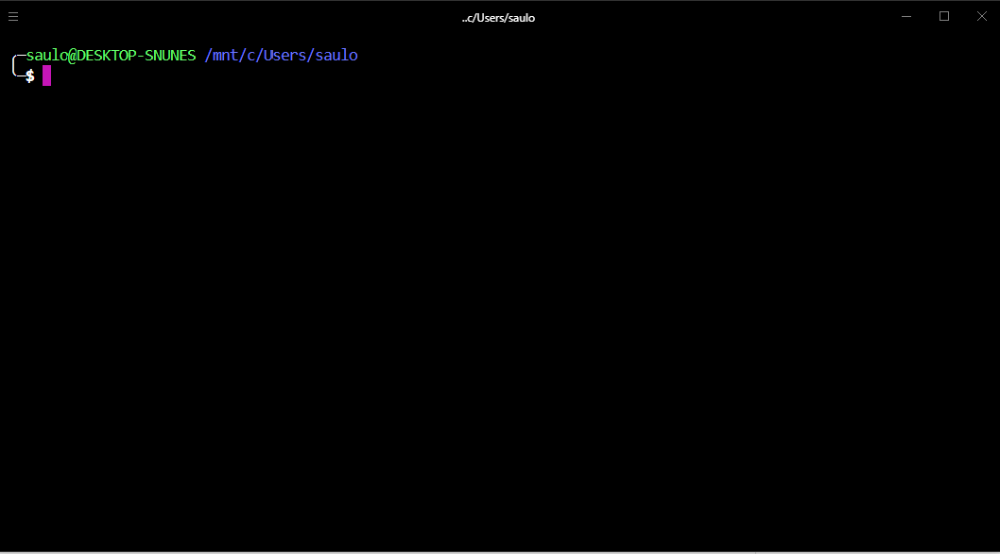

# Lista de Desafios

### 1. Aula 001

[Repositório](https://github.com/SauloNunes/collabcode)

[Alterar o Histórico de Commit](https://git-scm.com/book/pt-br/v1/Ferramentas-do-Git-Reescrevendo-o-Hist%C3%B3rico)
`git commit --amend`

### 2. Aula 002

[Alinhar Horizontalmente o Header -LojaFone](https://saulonunes.github.io/collabcode/projetos/loja-fone/)

### 3. Aula 003

[Inserir Botão Comprar e ALinhar Verticalmente no Centro -LojaFone](https://saulonunes.github.io/collabcode/projetos/loja-fone/)

### 4. Aula 004

[Leitura dos Artigos - Pare de chutar e aprenda as propriedades CSS de posicionamento
](https://medium.com/collabcode/pare-de-chutar-e-aprenda-as-propriedades-css-de-posicionamento-603154655121)

### 5. Aula 005

[Adicionado Imagem do Produto e Alinhamento Descricao -LojaFone](https://saulonunes.github.io/collabcode/projetos/loja-fone/)
